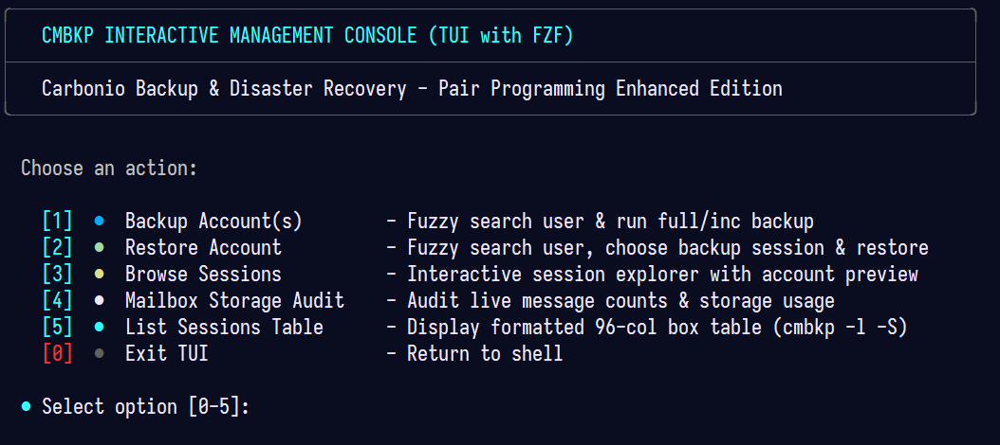
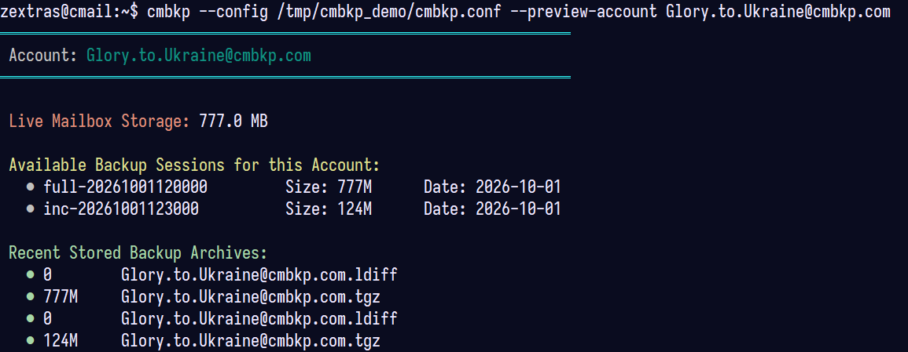
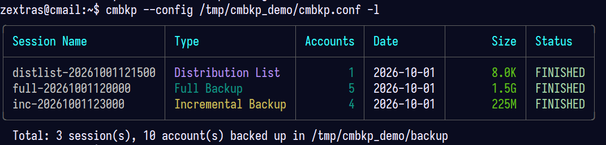
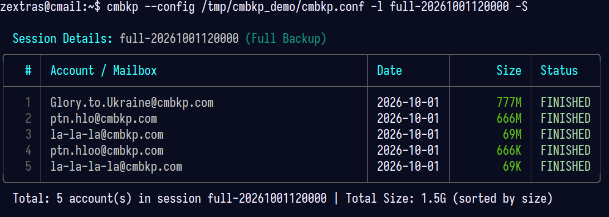

# cmbkp - Backup & Restore Suite for Carbonio Community Edition (CE)
====================================================================

**cmbkp** (formerly `cmbackup`) is an enhanced, robust, and production-tested hot backup and disaster recovery suite designed specifically for **Zextras Carbonio Community Edition (CE)**.

Based on the original `zmbackup` / `cmbackup` implementations (Lucas Costa Beyeler, Anahuac Gil, Marco Steinacher), this version (1.3.1) incorporates architectural innovations, performance optimizations, and reliability safeguards developed during large-scale production migrations in **Z2C (Zimbra to Carbonio Migration Suite)**, alongside a powerful interactive **TUI with `fzf`** for lightning-fast search and management.

> [!NOTE]
> **Backward Compatibility**: `cmbackup` is fully maintained as an alias and symlink (`/usr/local/bin/cmbackup -> cmbkp`). All existing cron jobs, scripts, and commands invoking `cmbackup` continue to work without modification.

[](https://www.zextras.com/carbonio-community-edition)
[](https://ubuntu.com/)
[](https://github.com/kit400/cmbkp/releases)
[](CHANGELOG.md)
[](LICENSE)

**Quick Links:** [Upgrade Guide](docs/UPGRADE.md) • [Bugfixes Reference](docs/BUGFIXES.md) • [Changelog](CHANGELOG.md) • [Screenshots Gallery](docs/screenshots/README.md)

---

<p align="center">
  
</p>

---

## Key Features & Enhancements

1. **Interactive TUI with `fzf` Search (`--tui` / `-ui`)**:
   - Interactive console menu to manage backups, restores, and sessions without memorizing command-line syntax.
   - Fuzzy-search accounts with live side-by-side preview showing live mailbox storage, past backup history, and archives on disk.
   - Interactive multi-select (using <kbd>Tab</kbd>) to batch-backup multiple accounts.
   - Interactive restore wizard: select account, choose from available backup sessions with preview, select destination account (with `-ro` support), and confirm execution.

2. **Pre-Flight Disk Space Safeguards (from Z2C)**:
   - Evaluates free disk space before dumping mailboxes or restoring.
   - Enforces configurable `MIN_FREE_DISK_GB` (default: 5 GB) threshold to prevent filling the partition and crashing Carbonio databases / mailboxd services.

3. **LPT (Longest Processing Time First) Parallel Scheduling (from Z2C)**:
   - Queries mailbox quotas/sizes (`zmprov gqu localhost`) and sorts accounts descending before queuing jobs in GNU Parallel.
   - Largest mailboxes start processing immediately, preventing queue bottlenecks and finishing multi-core backup runs up to **3x faster**.

4. **HTTP 204 No Data & Clean Dumps Detection (from Z2C)**:
   - In incremental routines, detects when Carbonio REST returns HTTP `204 No Data` or empty archives.
   - Automatically skips empty dump creation and purges 0-byte `.tgz` files to keep storage clean.

5. **Mailbox Audit & Message Verification (`--verify` / `-c`)**:
   - Compare and audit live mailbox folder message counts (`zmmailbox -z -m <account> gaf`) before and after backups/restores.

6. **Consistent 96-Column Unicode Box Tables & Subtle Color Accents**:
   - Uniform 96-column box-drawing tables for both session lists (`cmbkp -l`) and detailed session views (`cmbkp -l <session>`).
   - `Date` positioned before `Size` with matched column widths.
   - Backup types highlighted in distinct, subtle colors (Blue for Full, Cyan for Incremental, Purple for Distribution List, Magenta for Alias).
   - Fast sorting by backup size: `cmbkp -l -S` or `cmbkp -l <session> -S`.

7. **Dry-Run Mode (`--dry-run`)**:
   - Preview backup sessions, affected accounts, and estimated messages without downloading data or altering disk state.

8. **Flexible Configuration & Auto-Detection**:
   - Automatic fallback discovery for OpenLDAP binaries (`/opt/zextras/common/bin`), `zmmailbox`, and `zmlocalconfig`.
   - Auto-resolves `LDAPSERVER`, `LDAPADMIN`, and `LDAPPASS` from Carbonio configuration if left blank.

9. **Configurable REST URL (`ZMMAILBOX_URL`)**:
   - Support for custom endpoints (`https://localhost:7071`, `https://127.0.0.1:8443`, etc.) to prevent socket timeouts and connection refusals.

10. **Modern Installer & OS Support**:
    - Native support for Ubuntu 22.04, 24.04 (Noble Numbat), Debian, and RHEL/Rocky/AlmaLinux 8–9.
    - Automatic installation of dependencies including `fzf` and `parallel`.
    - Unattended non-interactive installation via `./install.sh -y` or `--unattended`.

---

## Requirements

* **fzf** (`apt install fzf` or `dnf install fzf`)
* **GNU Parallel** (`apt install parallel` or `dnf install parallel`)
* **SQLite3** (`apt install sqlite3` or `dnf install sqlite`)
* **Carbonio CE** (`/opt/zextras` installed and active)

---

## Installation

### Fast Unattended Install (Recommended)

Run as `root` on your Carbonio server:

```bash
git clone https://github.com/kit400/cmbkp.git /tmp/cmbkp
cd /tmp/cmbkp
./install.sh -y
```

### Interactive Install

```bash
cd /tmp/cmbkp
./install.sh
```

To verify installation:

### Upgrading from cmbackup

Upgrading an existing `cmbackup` (or `zmbackup`) installation is automatic, non-destructive, and 100% backward-compatible. Existing configurations and backup archives are completely preserved.

See the complete [**Upgrade Guide (docs/UPGRADE.md)**](docs/UPGRADE.md) for step-by-step upgrade instructions and verification steps.

---

## Interactive TUI (Terminal User Interface)

Launch the interactive management console:

```bash
su - zextras -c "cmbkp --tui"
# or simply:
su - zextras -c "cmbkp -ui"
```

### TUI Capabilities

* **Backup Account(s) (`cmbkp -f --tui` / menu option 1)**:
  - Search any mailbox account instantly using fuzzy typing.
  - Live preview pane displays live storage used, past backup dates, and recent archive files.
  - Multi-select accounts using <kbd>Tab</kbd>, then choose backup mode: Full, Incremental, Mailbox-only, LDAP-only, or Dry-run.
* **Restore Account (`cmbkp -r --tui` / menu option 2)**:
  - Select target account to restore via fuzzy search.
  - Browse available backup sessions for this specific account with live metadata preview.
  - Choose restore destination: restore to original account or alternate account (`-ro`), restore mailbox only, or LDAP metadata only.
  - Safety confirmation prompt before restoring.
* **Session Explorer (menu option 3)**:
  - Browse past backup sessions with a live preview of all contained mailboxes and sizes.
  - Press <kbd>Enter</kbd> to inspect the session in formatted 96-column table view.

<p align="center">
  <br>
  <em>Side-by-side account preview pane with live mailbox quota, available backup sessions, and archive file listings</em>
</p>

---

## CLI Usage Guide

```bash
cmbkp -h
```

### Full Backups (`-f`, `--full`)

```bash
# Interactive backup wizard with fzf
su - zextras -c "cmbkp -f --tui"

# Backup all active accounts (LDAP + Mailbox)
su - zextras -c "cmbkp -f"

# Backup only specific accounts (comma separated)
su - zextras -c "cmbkp -f -a user1@domain.com,user2@domain.com"

# Backup only a specific domain
su - zextras -c "cmbkp -f -d domain.com"

# Backup only mailboxes (no LDAP)
su - zextras -c "cmbkp -f -m"

# Backup only LDAP entries
su - zextras -c "cmbkp -f -ldp"

# Backup distribution lists or aliases
su - zextras -c "cmbkp -f -dl"
su - zextras -c "cmbkp -f -al"
```

### Incremental Backups (`-i`, `--incremental`)

```bash
# Incremental backup for all accounts (only changes since last backup)
su - zextras -c "cmbkp -i"

# Incremental backup for specific account
su - zextras -c "cmbkp -i user@domain.com"

# Incremental backup with explicit since date
su - zextras -c "cmbkp -i --since 2026-09-01 -a user@domain.com"
```

### Dry-Run Simulation (`--dry-run`)

Test run without transferring data:

```bash
su - zextras -c "cmbkp -i --dry-run"
```

### Mailbox Audit & Verification (`-c`, `--verify`)

Audit live mailbox message counts:

```bash
# Verify specific account
su - zextras -c "cmbkp -c user@domain.com"

# Verify all active accounts sorted by size
su - zextras -c "cmbkp -c -S"
```

### Listing & Inspecting Sessions (`-l`, `--list`)

```bash
# List all backup sessions (chronological order)
su - zextras -c "cmbkp -l"

# List backup sessions sorted by size (largest first)
su - zextras -c "cmbkp -l -S"
```

Output:

<p align="center">
  
</p>

Inspect accounts inside a specific session (with optional size sorting `-S`):

```bash
# Inspect accounts in a session
su - zextras -c "cmbkp -l full-20261001120000"

# Inspect accounts in a session sorted by size
su - zextras -c "cmbkp -l full-20261001120000 -S"
```

Output (matching 96-column width with session list):

<p align="center">
  
</p>

### Restoring Backups (`-r`, `--restore`)

```bash
# Interactive restore wizard with fzf
su - zextras -c "cmbkp -r --tui"

# Restore entire session (LDAP + Mailbox)
su - zextras -c "cmbkp -r full-20260930190000"

# Restore only one account from session
su - zextras -c "cmbkp -r full-20260930190000 user@domain.com"

# Restore an account into a different account (Restore on Account)
su - zextras -c "cmbkp -r -ro full-20260930190000 source@domain.com target@domain.com"
```

### Maintenance & Housekeeping

```bash
# Delete specific session
su - zextras -c "cmbkp -d full-20260930190000"

# Run housekeeper to clean sessions older than ROTATE_TIME days
su - zextras -c "cmbkp -hp"
```

---

## Configuration (`/etc/cmbkp/cmbkp.conf`)

Key parameters in `/etc/cmbkp/cmbkp.conf` (symlinked from `/etc/cmbackup/cmbackup.conf`):

```ini
BACKUPUSER=zextras
WORKDIR=/opt/zextras/backup
ZMMAILBOX=/opt/zextras/bin/zmmailbox
ZMMAILBOX_URL=https://localhost:7071
MAX_PARALLEL_PROCESS=4
ROTATE_TIME=30
MIN_FREE_DISK_GB=5
SESSION_TYPE=SQLITE3
```

---

## Demo Dataset & Testing

A mock dataset generator is included to test the TUI, verify table formatting, and reproduce these screenshots safely with test domain `cmbkp.com`:

```bash
# Generate demo environment in /tmp/cmbkp_demo
cmbkp-demo
# or from git repository:
./tools/create_demo_dataset.sh

# Run interactive TUI with demo dataset:
/tmp/cmbkp_demo/run_demo_tui.sh
# or via cmbkp CLI:
cmbkp --config /tmp/cmbkp_demo/cmbkp.conf --tui
```

---

## Authors & Credits

* **Lucas Costa Beyeler** - Original author of `zmbackup`
* **Anahuac Gil** - Initial port from `zmbackup` to `cmbackup` for Carbonio CE
* **Marco Steinacher** - PR #1 fixes (ZMMAILBOX_URL, regex expansions, SQLite race conditions)
* **kit400** - Fork maintenance (`cmbkp`), Z2C architecture integrations, fzf TUI suite, Ubuntu 24.04 compatibility, and v1.3.0 enhancements.

